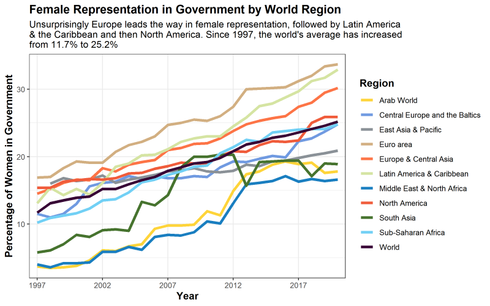
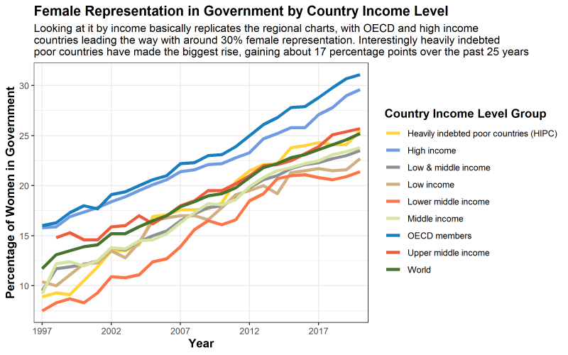
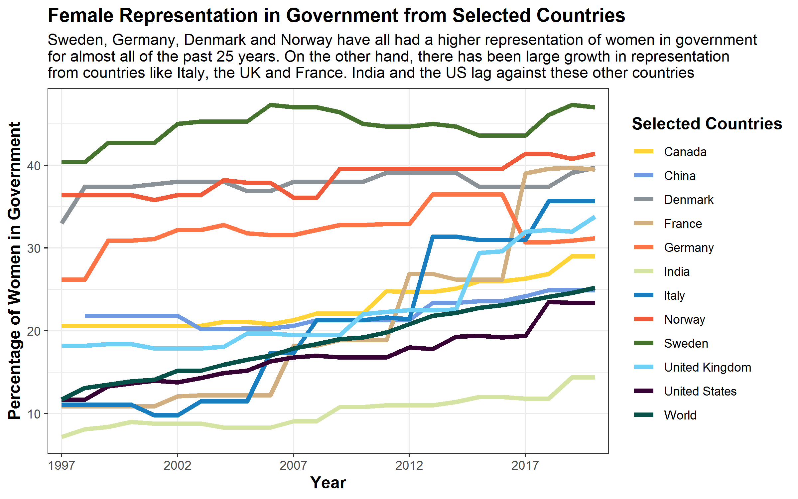
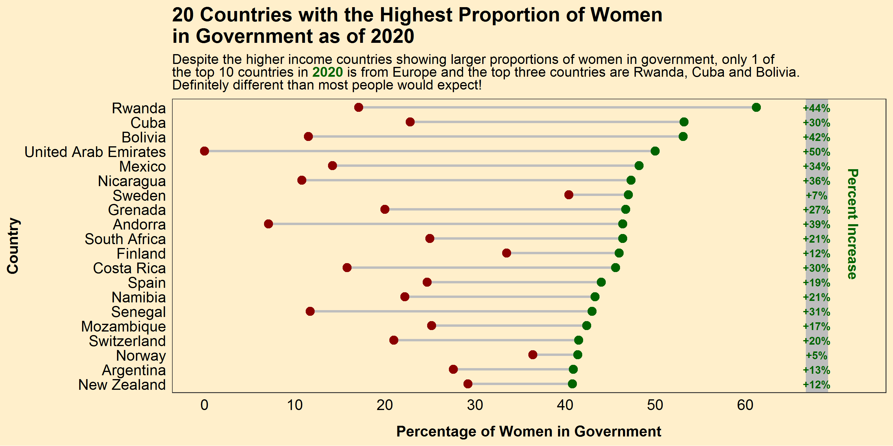
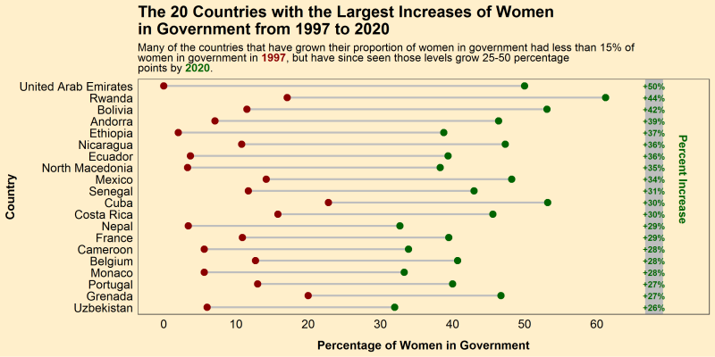

**Happy International Women's Day!**

In the spirit of the day, I wanted to do a post **celebrating the many wonderful women of this world**. In keeping with my political analytics topics, I thought it would be interesting to look at the **proportion of women are in government by country**, and **how that has changed over the past few decades**. Luckily [The World bank](https://databank.worldbank.org/reports.aspx?source=2&series=SG.GEN.PARL.ZS&country=#) has such a dataset, measuring the proportion of government seat's held by women in every country throughout the world. Let's get to it and visualize this data!

**In total, I will walk you through 5 visualizations:**

1.  Graph \#1 - Female Representation in Government by World Region

2.  Graph \#2 - Female Representation in Government by Country Income Level

3.  Graph \#3 - Female Representation in Government from Selected Countries

4.  Graph \#4 - 20 Countries with the Highest Proportion of Women in Government as of 2020

5.  Graph \#5 - The 20 Countries with the Largest Increases of Women in Government from 1997 to 2020

```{r include = FALSE}
knitr::opts_chunk$set(message = FALSE)
knitr::opts_chunk$set(warning = FALSE)
knitr::opts_chunk$set(eval = FALSE)
```

## Step 1 - Download & Clean the Data

First, let's clean the data. You can find the original csv file [here on my GitHub](https://github.com/danderson222/women-in-government). To clean the data, there are three steps. First, change the column names so they are easier to read using `substring()` to cut the year names by a few characters and the `make_clean_names()` function from the `janitor` package to clean up the other names. Then change all the missing data (".." in the original dataset) to NAs using the `na_if()` function, while converting all the year columns to numeric with `sapply()`. There you have it, a relatively clean master dataframe!

```{r}
# Load the necessary packages
# Tidyverse is our rock in data analysis (includes ggplot2)
if(!require("tidyverse")) install.packages("tidyverse") 
# Janitor cleans data like the best janitor out there!
if(!require("janitor")) install.packages("janitor")
# ggsci has my favourite color palettes
if(!require("ggsci")) install.packages("ggsci")
# ggalt is necessary for the dumbbell chart
if(!require("ggalt")) install.packages("ggalt") 
# ggtext allows for great text to include for charts
if(!require("ggtext")) install.packages("ggtext") 

# Load the csv data file
df <- read_csv("WomenInGovernment_Data.csv")

# Change the column names to account for each year of the data 1997-2020
names <- colnames(df)[4:27]
names <- substring(names, 7,12)
colnames(df)[4:27] <- names
colnames(df) <- janitor::make_clean_names(colnames(df))

# Change all the ..s in the data to NAs and then convert the columns to numeric
df[,4:27] <- na_if(df[,4:27], "..")
df[,4:27] <- sapply(df[,4:27],as.numeric) %>% 
  round(digits = 1)
```

After this, I want to make it simple for the reader so I **divide the large dataset into 5 separate ones, one for each plot that we are creating**. To do this we use the `filter()` function, which allows us to cut it whatever way we want. I also use the `pivot_longer()` function to recreate the dataframes and make them more *tidy* for our analysis. This is a good practice I almost always neglect to do...

Lastly, for the dumbbell charts we create a **column that calculates the change between 1997 and 2020**. We then rank order the countries by either the proportion of females in government (4th chart) or the change from 1997-2020 (5th chart).

```{r}
# Create a dataset for each chart, just to make it .
# For this we filter the data for the region, income or country, then make the graph longer using the pivot_longer() function
# Regional chart dataset
df.region <- df %>% 
  filter(category == "Region" | category == "World") %>% 
  pivot_longer(cols = starts_with("yr"), names_to = "year", names_prefix = "yr",
               values_to = "value", values_drop_na = TRUE)

# Income chart dataset
df.income <- df %>% 
  filter(category == "Income" | category == "World") %>% 
  pivot_longer(cols = starts_with("yr"), names_to = "year", names_prefix = "yr",
               values_to = "value", values_drop_na = TRUE)

# Selected Countries chart (Chose countries that are either near and dear to me or where my readers tend to be)
selected_countries <- c("World", "Canada", "China", "Denmark", "France", "Germany", "India", 
                        "Italy", "Norway", "Sweden", "United Kingdom", "United States")
df.country <- df %>% 
  filter(country_name %in% selected_countries| category == "World") %>%
  pivot_longer(cols = starts_with("yr"), names_to = "year", names_prefix = "yr",
               values_to = "value", values_drop_na = TRUE)

# Top Female representation by country dumbbell chart
df.top.dumbbell <- df %>% 
  filter(category == "Country") 
df.top.dumbbell$change <- df.top.dumbbell$yr2020 - df.top.dumbbell$yr1997
df.top.dumbbell <- head(arrange(df.top.dumbbell, desc(yr2020)), n = 20) %>% 
  droplevels()
df.top.dumbbell$country_name <- factor(df.top.dumbbell$country_name, levels = as.character(df.top.dumbbell$country_name))  # to retain the order in plot.

# Top Female Increase in representation dumbbell chart
df.change.dumbbell <- df %>% 
  filter(category == "Country") 
df.change.dumbbell$change <- df.change.dumbbell$yr2020 - df.change.dumbbell$yr1997
df.change.dumbbell <- head(arrange(df.change.dumbbell, desc(change)), n = 20) %>% 
  droplevels()
df.change.dumbbell$country_name <- factor(df.change.dumbbell$country_name, levels = as.character(df.change.dumbbell$country_name))  # to retain the order in plot.
```

## Step 2 - Time to Graph

Okay, now we have created five separate dataframes, each one will tell a different story about how female representation in national government has changed over the past 24 years.

### Graph \#1 - Female Representation in Government by World Region

Before starting, we create set the basic theme with `theme_set()` and create a folder for all the plots using `dir.create()`. I explain how I create each plot pretty detailed in the code, so no need to bore you with more text. The first graph concerns the **regions of the world**.

```{r}
# Let's set the theme and create a folder to store your output
theme_set(theme_bw())
dir.create("plots")

# First create a plot of all the regional representation of women in government
region.plot <- ggplot(df.region, aes(x=year,y=value,group=country_name,color=country_name)) +
  geom_line(size = 1.5) +
  
  # My top color palette
  scale_color_simpsons() +
  
  # Set the x-axis scale
  scale_x_discrete(breaks=c(1997,2002,2007,2012,2017)) +
  
  # Update the labels of the axes
  labs(x = "Year",
       y = "Percentage of Women in Government",
       title = "Female Representation in Government by World Region",
       subtitle = "Unsurprisingly Europe leads the way in female representation, followed by Latin America \n& the Caribbean and then North America. Since 1997, the world's average has increased \nfrom 11.7% to 25.2%",
       color = "Region")  +
 
   #Adjust the axes
  theme(plot.title = element_text(face="bold", size =14), 
        axis.title.x = element_text(face="bold", size = 12),
        axis.title.y = element_text(face="bold", size = 12),
        legend.title = element_text(face="bold", size = 12))
region.plot
# Save the plot!
ggsave("plots/RegionalPlot.png", region.plot, height = 5, width = 8)
```

 
<br>

The first plot is interesting. As we can see, female representation is highest in Europe and the Americas, while the Middle East, North Africa, and South East Asia are lagging behind. The biggest positive we can pull from this is that **the world average of women representation has more than doubled in the past 25 years to about a quarter.** However, that is still very low and hopefully we will see that number continue to rise. **At the current slope, we won't see a 50/50 mix until around 2065, which is way too late for equal representation...**

### Graph \#2 - Female Representation in Government by Country Income Level

Time to graph the second chart, this time **by income level of countries.**

```{r}
# Next comes all the countries by income level
income.plot <- ggplot(df.income, aes(x=year,y=value,group=country_name,colour=country_name)) +
  geom_line(size = 1.5) +
  scale_color_simpsons() +
  scale_x_discrete(breaks=c(1997,2002,2007,2012,2017)) +
  labs(x = "Year",
       y = "Percentage of Women in Government",
       title = "Female Representation in Government by Country Income Level",
       subtitle = "Looking at it by income basically replicates the regional charts, with OECD and high income \ncountries leading the way with around 30% female representation. Interestingly heavily indebted \npoor countries have made the biggest rise, gaining about 17 percentage points over the past 25 years",
       color = "Country Income Level Group")  +
  theme(plot.title = element_text(face="bold", size =14), 
        axis.title.x = element_text(face="bold", size = 12),
        axis.title.y = element_text(face="bold", size = 12),
        legend.title = element_text(face="bold", size = 12))
income.plot
ggsave("plots/IncomePlot.png", income.plot, height = 5, width = 8)
```

 
<br>

Much like the first plot, richer countries, that tend to be in Europe or the Americas, have a higher proportion of female representation in government. **The rankings break down neatly by income with the top three lines all being from upper middle to richer countries**, so there would definitely be a correlation between the two if you were to do further analysis.

### Graph \#3 - Female Representation in Government by Country Income Level

Time to do some analysis on a few well-known countries (and some that are closer to my heart).

```{r}
# Third comes my selected countries
country.plot <- ggplot(df.country, aes(x=year,y=value,group=country_name,colour=country_name)) +
  geom_line(size = 1.5) +
  scale_color_simpsons() +
  scale_x_discrete(breaks=c(1997,2002,2007,2012,2017)) +
  labs(x = "Year",
       y = "Percentage of Women in Government",
       title = "Female Representation in Government from Selected Countries",
       subtitle = "Sweden, Germany, Denmark and Norway have all had a higher representation of women in government \nfor almost all of the past 25 years. On the other hand, there has been large growth in representation \nfrom countries like Italy, the UK and France. India and the US lag against these other countries",
       color = "Selected Countries")  +
  theme(plot.title = element_text(face="bold", size =14), 
        axis.title.x = element_text(face="bold", size = 12),
        axis.title.y = element_text(face="bold", size = 12),
        legend.title = element_text(face="bold", size = 12))
country.plot
ggsave("plots/CountryPlot.png", country.plot, height = 5, width = 8)
```

 
<br>

The biggest takeaway from this plot is seeing **the plateau around 40% of female representation** in Germany, Denmark, Norway and Sweden. It will be interesting to see whether they ever reach that 50%. Meanwhile some **countries like Italy, the UK and France have shot up over the past ten years**. You can really see the jump in the UK in 2015 when the Labour Party (one of the top two) made a huge effort to field more female MPs, which brought up female representation in Parliament by about 7 percentage points! Definitely a positive for better representation and diversity.

### Graph \#4 - Female Representation in Government by Country Income Level

**Now I wanted to plot some dumbbell charts,** a way to really compare data from two different points in history, or between two different groups. To plot these charts we use the `geom_dumbbell()` function from the `ggalt` package, which allows you to add dumbbell-like icons to plot the data you initially called in the `ggplot()` function. This takes a lot more formatting, as you can see I use functions like `geom_text()`, `geom_rect()` and `annotate()` to add in some cool side borders and language. I do want to shout out to [tessaeagle](https://github.com/tessaeagle/TidyTuesday/blob/master/2021/2_2_21.R) from GitHub for her dumbbell graph code from a recent TidyTuesday that I found on Twitter, which really helped me get the base code to make these next two charts!

So for the **first dumbbell chart I wanted to look at the 20 countries with the highest proportion of women in government**. I also show the percent increase that each country had from 1997 to 2020 on the right hand side.

```{r}
# Okay now for the pretty dumbbell charts
# The first dumbbell chart shows
top.dumbbell.plot <- ggplot(df.top.dumbbell, aes(y = country_name, x = yr1997, xend = yr2020, group=country_name)) +
  geom_dumbbell(size= 1, size_x = 3, size_xend = 3, colour_x = "darkred", colour_xend = "darkgreen", colour = "grey") +
  labs(
    y = "Country",
    x = "Percentage of Women in Government",
    title = "20 Countries with the Highest Proportion of Women \nin Government as of 2020",
    subtitle = "Despite the higher income countries showing larger proportions of women in government, only 1 of <br>the top 10 countries in <span style = 'color:darkgreen'><b>2020</b></span> is from Europe and the top three countries are Rwanda, Cuba and Bolivia. <br>A huge increase from <span style = 'color:darkred'><b>1997</b></span>, and definitely a different result than most people would expect!"
  )+
  scale_x_continuous(breaks = seq(from = 0, to = 60, by = 10)) +
  scale_y_discrete(limits = rev(levels(df.top.dumbbell$country_name))) +
  theme(
    panel.background = element_rect(fill = "#FFEFCB", color = NA),
    plot.background = element_rect(fill = "#FFEFCB", color = NA),
    panel.grid = element_blank(),
    axis.ticks = element_blank(),
    axis.text = element_text(size = 12, color = "black"),
    axis.title.x = element_text(face = "bold", size = 12, margin = margin(t = 10, r = 0, b = 0, l = 0)),
    axis.title.y = element_text(face = "bold", size = 12),
    plot.title = element_text(size = 16, face = "bold"),
    plot.subtitle = element_markdown()
  ) +
  geom_rect(data = df.top.dumbbell, aes(xmin = max(yr2020) * 1.09, xmax = max(yr2020) * 1.13, ymin = -Inf, ymax = Inf), fill = "grey") +
  annotate(geom="text", x = 72, y= df.top.dumbbell$country_name[9], angle = 270,
           label=c("Percent Increase"), color="darkgreen", size = 4, fontface = 'bold') +  
  geom_text(data = df.top.dumbbell, aes(label = paste0("+", round(change), "%"), y = country_name, x = max(yr2020) * 1.11), fontface = "bold", size = 3, color = "darkgreen")
top.dumbbell.plot
ggsave("plots/TopdumbbellPlot.png", top.dumbbell.plot, height = 5, width = 10)
```

 
<br>

This chart is telling because **despite all the progress you can see that only three countries actually break the 50% barrier in terms of representation**: Rwanda, Cuba and Bolivia. Obviously 3/246 countries evaluated being over 50% female representation is not even close to equality, so the world still has a way to go. One interesting thing to note from this chart is the lack of European and North American countries in the top 10, showing that **maybe income is not always the best indicator of representation**!

### Graph \#5 - Female Representation in Government by Country Income Level

Finally, the last chart for my Women's Day post. This dumbbell chart looks at the **largest increases in representation by country.**

```{r}
# The second dumbbell chart
change.dumbbell.plot <- ggplot(df.change.dumbbell, aes(y = country_name, x = yr1997, xend = yr2020, group=country_name)) +
  geom_dumbbell(size= 1, size_x = 3, size_xend = 3, colour_x = "darkred", colour_xend = "darkgreen", colour = "grey") +
  labs(
    y = "Country",
    x = "Percentage of Women in Government",
    title = "The 20 Countries with the Largest Increases of Women \nin Government from 1997 to 2020",
    subtitle = "Many of the countries that have grown their proportion of women in government had less than 15% of <br>women in government in <span style = 'color:darkred'><b>1997</b></span>, but have since seen those levels grow 25-50 percentage <br>points by <span style = 'color:darkgreen'><b>2020</b></span>."
  )+
  scale_x_continuous(breaks = seq(from = 0, to = 60, by = 10)) +
  scale_y_discrete(limits = rev(levels(df.change.dumbbell$country_name))) +
  theme(
    panel.background = element_rect(fill = "#FFEFCB", color = NA),
    plot.background = element_rect(fill = "#FFEFCB", color = NA),
    panel.grid = element_blank(),
    axis.ticks = element_blank(),
    axis.text = element_text(size = 12, color = "black"),
    axis.title.x = element_text(face = "bold", size = 12, margin = margin(t = 10, r = 0, b = 0, l = 0)),
    axis.title.y = element_text(face = "bold", size = 12),
    plot.title = element_text(size = 16, face = "bold"),
    plot.subtitle = element_markdown()
  ) +
  geom_rect(data = df.change.dumbbell, aes(xmin = max(yr2020) * 1.09, xmax = max(yr2020) * 1.13, ymin = -Inf, ymax = Inf), fill = "grey") +
  annotate(geom="text", x = 72, y= df.change.dumbbell$country_name[9], angle = 270,
           label=c("Percent Increase"), color="darkgreen", size = 4, fontface = 'bold') +  
  geom_text(data = df.change.dumbbell, aes(label = paste0("+", round(change), "%"), y = country_name, x = max(yr2020) * 1.11), fontface = "bold", size = 3, color = "darkgreen")
change.dumbbell.plot
ggsave("plots/ChangedumbbellPlot.png", change.dumbbell.plot, height = 5, width = 10)
```

 
<br>

The leader in this chart is the United Arab Emirates, which I find very surprising and peculiar. A bit more research shows that the UAE is not a democracy, so these are not democratically elected women, but appointed by the monarch. So this isn't really equality in my mind.

But the **rise from other countries of over 35 percentage points in places like Rwanda, Bolivia, Andorra, Ethiopia, and more are really inspiring**. A lot of these countries went from barely any female representation to a decent amount, so there is **still a ton of work to be done**. But at least now you know what the world of women in politics looks like and hopefully more female gains can be made in the years to come! **Happy International Women's Day to all the amazing ladies out there!**

------------------------------------------------------------------------

**References:** 
<br> 
[1] The World Bank DataBank, [World Development Indicators = Proportion of Seats Held by Women in National Parlianments](https://databank.worldbank.org/reports.aspx?source=2&series=SG.GEN.PARL.ZS&country=#), (2021) 
<br>

------------------------------------------------------------------------

*I am a Simulation & Strategy Consultant at Monitor Deloitte, I use stats and analytics to inform Digital Twin models that re-invent the way companies approach strategic decisions. In my free time, I'm obsessed with politics and policy, blogging about it all the time at [Policy In Numbers](https://www.policyinnumbers.com). You can find me there or at my [LinkedIn](https://www.linkedin.com/in/dylansjanderson/) and [Twitter](https://twitter.com/dylansjanderson) accounts (feel free to connect or give me a follow).*